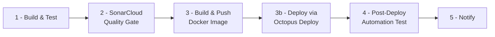

# PracticeConsoleApp

A .NET demo of bulk-fetching data and bulk-publishing to SQS in parallel, with retry/failure handling, deployed as an AWS Lambda function.

| Project | Target | Purpose |
|---|---|---|
| [PracticeConsoleApp](PracticeConsoleApp/) | net10.0, console | Demo/CLI host for `BatchDataFetcher` and `SqsBulkPublisher` (`Program.cs` runs a few scripted scenarios and prints the results) |
| [PracticeConsoleApp.SqsBulkPushFunction](PracticeConsoleApp.SqsBulkPushFunction/) | net8.0, Lambda | The real deployable: an AWS Lambda handler that fans out messages to SQS via `SqsBulkPublisher` |
| [PracticeConsoleApp.Tests](PracticeConsoleApp.Tests/) | net10.0, xUnit | Unit tests for the shared logic (23 tests, ~76% line coverage) |

## CI/CD pipeline

Every push to `main` runs [.github/workflows/ci-cd.yml](.github/workflows/ci-cd.yml), a 5-stage pipeline. Each stage only starts if the one before it succeeded:



This document explains that workflow file line by line, then lists the one-time setup (secrets, external services) it depends on.

---

## Line-by-line walkthrough of `ci-cd.yml`

### Header, trigger, concurrency (lines 1-13)

```yaml
name: CI/CD
```
The name shown for this workflow in the GitHub Actions tab.

```yaml
on:
  push:
    branches: [main]
```
GitHub Actions has no literal "after each commit" trigger — the closest thing is `push`, which fires once per `git push` (i.e. once per batch of commits pushed, not literally once per commit if you push three commits at once). Restricting to `branches: [main]` means pushes to any other branch (e.g. `feature/x`) don't trigger a deployment; the intended flow is: work on a branch, open a PR, merge to `main`, and *that* merge's push is what ships.

```yaml
concurrency:
  group: ci-cd-${{ github.ref }}
  cancel-in-progress: true
```
`github.ref` is the branch ref, e.g. `refs/heads/main`. Every run on the same branch shares the group name `ci-cd-refs/heads/main`. `cancel-in-progress: true` means: if you push commit A, then push commit B a minute later while A's pipeline is still running, GitHub cancels A's run and only B's runs to completion. Without this, two pipelines could both reach the Octopus deploy stage and race to deploy different images.

### Shared environment variables (lines 15-20)

```yaml
env:
  DOTNET_NOLOGO: true
  DOTNET_CLI_TELEMETRY_OPTOUT: true
  AWS_REGION: ${{ vars.AWS_REGION || 'us-east-1' }}
  ECR_REPOSITORY: ${{ vars.ECR_REPOSITORY || 'sqs-bulk-push-function' }}
  LAMBDA_FUNCTION_NAME: ${{ vars.LAMBDA_FUNCTION_NAME || 'sqs-bulk-push' }}
```
These are available to every job as shell environment variables (e.g. `$AWS_REGION` inside a `run:` step).
- `DOTNET_NOLOGO` / `DOTNET_CLI_TELEMETRY_OPTOUT`: quiets the dotnet CLI's startup banner and disables telemetry pings, purely to keep logs clean and runs fast.
- `vars.AWS_REGION` reads a GitHub **repository variable** (Settings → Secrets and variables → Actions → Variables). The `||` is YAML-expression OR: if that repo variable doesn't exist or is empty, the right-hand default is used instead. Example: if you never set `AWS_REGION` as a repo variable, every job sees `AWS_REGION=us-east-1`; if you later add a repo variable `AWS_REGION=ap-south-1`, every job picks that up on the next run with no file change needed.
- Same pattern for `ECR_REPOSITORY` (which ECR repo to push the image to) and `LAMBDA_FUNCTION_NAME` (which Lambda function stage 4 invokes to smoke-test).

### `jobs:` (line 22 onward)

Each job below runs on its own fresh `ubuntu-latest` VM — nothing is shared between jobs except what's explicitly passed via `needs.<job>.outputs.*` or artifacts (`actions/upload-artifact` / `download-artifact`).

---

### Stage 1 — `build-and-test` (lines 29-64)

```yaml
build-and-test:
  name: 1 - Build & Test
  runs-on: ubuntu-latest
```
Job id `build-and-test` (used elsewhere via `needs:`); `name:` is just the display label in the Actions UI.

```yaml
steps:
  - uses: actions/checkout@v4
```
Clones the repository at the pushed commit into the runner's working directory. Almost every job needs this first.

```yaml
  - uses: actions/setup-dotnet@v4
    with:
      dotnet-version: |
        8.0.x
        10.0.x
```
Installs *both* .NET SDKs on the runner, because the solution is multi-targeted: the Lambda project targets `net8.0`, the console app and test project target `net10.0`. The `|` is a YAML block scalar — it passes a multi-line string, and `setup-dotnet` installs one SDK per line.

```yaml
  - name: Restore
    run: dotnet restore PracticeConsoleApp.slnx
```
Downloads NuGet packages for every project in the solution file. Example: this is where `coverlet.msbuild`, `Moq`, `xunit`, `AWSSDK.SQS` etc. get pulled down.

```yaml
  - name: Build (Release)
    run: dotnet build PracticeConsoleApp.slnx --configuration Release --no-restore
```
Compiles all three projects in Release mode. `--no-restore` skips re-resolving packages since the previous step already did it (saves ~10s).

```yaml
  - name: Test with coverage
    run: >
      dotnet test PracticeConsoleApp.Tests/PracticeConsoleApp.Tests.csproj
      --configuration Release --no-build
      --logger "trx;LogFileName=test-results.trx"
      --results-directory ./TestResults
      /p:CollectCoverage=true
      /p:CoverletOutputFormat=opencover
      /p:CoverletOutput=../TestResults/coverage/
```
Runs the 23 xUnit tests. `>` folds the multi-line YAML into one space-joined command. Breaking down the flags:
- `--logger "trx;LogFileName=test-results.trx"` — writes a Visual Studio-format test report to `TestResults/test-results.trx` (pass/fail per test, timings).
- `/p:CollectCoverage=true` / `/p:CoverletOutputFormat=opencover` / `/p:CoverletOutput=...` — MSBuild properties read by the `coverlet.msbuild` package (referenced in the test `.csproj`), instructing it to instrument the test run and emit `TestResults/coverage/coverage.opencover.xml` in OpenCover XML format — the format Stage 2's Sonar scanner expects.

Example output tail from a real run:
```
Passed!  - Failed: 0, Passed: 23, Skipped: 0, Total: 23
| Module             | Line   | Branch | Method |
| PracticeConsoleApp | 76.13% | 87.5%  | 87.17% |
```

```yaml
  - name: Upload test results & coverage
    uses: actions/upload-artifact@v4
    with:
      name: test-results
      path: TestResults/
      retention-days: 7
```
Stage 2 runs on a *different* runner/VM with an empty disk, so it can't see this job's `TestResults/` folder directly. `upload-artifact` zips that folder and stores it against this workflow run under the name `test-results`, downloadable from the run's summary page in the GitHub UI, and retrievable by a later job via `download-artifact` (see Stage 2). `retention-days: 7` auto-deletes it after a week to save storage.

---

### Stage 2 — `sonar-quality-gate` (lines 73-121)

```yaml
sonar-quality-gate:
  name: 2 - SonarCloud Quality Gate
  needs: build-and-test
  runs-on: ubuntu-latest
```
`needs: build-and-test` is the gate: this job is skipped entirely if `build-and-test` failed, and won't even start until it finishes successfully.

```yaml
  - uses: actions/checkout@v4
    with:
      fetch-depth: 0 # Sonar wants full git history for blame/new-code analysis
```
`checkout@v4` by default does a shallow clone (depth 1, just the latest commit) for speed. `fetch-depth: 0` fetches the *entire* git history instead, because Sonar's "new code" analysis (e.g. "0 new code smells since last analysis") needs `git blame` history to know which lines changed recently.

```yaml
  - uses: actions/setup-java@v4
    with:
      distribution: temurin
      java-version: '17' # the Sonar Scanner runs on the JVM
```
The Sonar Scanner engine itself is a Java application (even when driven through the `dotnet-sonarscanner` .NET wrapper), so a JVM must be present on the runner. `temurin` is the Eclipse Adoptium OpenJDK distribution.

```yaml
  - name: Download coverage from stage 1
    uses: actions/download-artifact@v4
    with:
      name: test-results
      path: TestResults
```
Pulls the artifact Stage 1 uploaded back down onto this runner's disk at `./TestResults`, recreating `TestResults/coverage/coverage.opencover.xml` and `TestResults/test-results.trx` here.

```yaml
  - name: Install dotnet-sonarscanner
    run: dotnet tool install --global dotnet-sonarscanner
```
Installs the `dotnet-sonarscanner` global tool (a thin wrapper that drives the Java scanner and hooks into MSBuild).

```yaml
  - name: Restore
    run: dotnet restore PracticeConsoleApp.slnx
```
Fresh runner, so packages need restoring again before the analysis build below.

```yaml
  - name: Sonar begin
    run: >
      dotnet sonarscanner begin
      /k:"${{ vars.SONAR_PROJECT_KEY }}"
      /o:"${{ vars.SONAR_ORGANIZATION }}"
      /d:sonar.host.url="${{ vars.SONAR_HOST_URL || 'https://sonarcloud.io' }}"
      /d:sonar.token="${{ secrets.SONAR_TOKEN }}"
      /d:sonar.cs.opencover.reportsPaths="TestResults/coverage/coverage.opencover.xml"
      /d:sonar.cs.vstest.reportsPaths="TestResults/test-results.trx"
      /d:sonar.coverage.exclusions="**/TestDoubles/**,**/*Tests.cs"
      /d:sonar.qualitygate.wait=true
```
This starts an analysis session — every build that happens between `begin` and `end` gets instrumented and its compiler output inspected. Flag by flag:
- `/k:` — the Sonar **project key**, e.g. `purushottam17031983_PracticeConsoleApp` (SonarCloud's convention: `<org>_<repo>`). Identifies which Sonar project this analysis belongs to.
- `/o:` — the Sonar **organization** key (SonarCloud groups projects under an org), e.g. `purushottam17031983`.
- `sonar.host.url` — which server to talk to; defaults to SonarCloud, but if you self-host SonarQube you'd set the repo variable `SONAR_HOST_URL` to e.g. `https://sonarqube.mycompany.com`.
- `sonar.token` — an auth token (a GitHub *secret*, never a plain variable, since it grants write access to the Sonar project).
- `sonar.cs.opencover.reportsPaths` — tells Sonar exactly where to find the coverage XML produced in Stage 1, so it can compute "X% line coverage" against the analyzed code.
- `sonar.cs.vstest.reportsPaths` — points at the `.trx` file so Sonar's UI also shows test pass/fail counts, not just coverage.
- `sonar.coverage.exclusions` — glob patterns for files that should be *left out of the coverage percentage entirely* (not analyzed for bugs/smells, just excluded from the coverage denominator). Here: the hand-rolled test doubles (`TestDoubles/`) and the test files themselves — testing your tests would be circular.
- `sonar.qualitygate.wait=true` — the important one: it makes the later `sonarscanner end` step **block and poll** Sonar's server after uploading results, until the Quality Gate (pass/fail rules configured server-side — see [scripts/setup-sonar-quality-gate.sh](scripts/setup-sonar-quality-gate.sh)) evaluates, and **exit with a non-zero code if the gate is red**.

```yaml
  - name: Build (analysis pass)
    run: dotnet build PracticeConsoleApp.slnx --configuration Release --no-restore
```
A second build of the whole solution — this one happens *while the scanner session is active*, so the scanner can hook into the C# compiler and extract the data (code smells, complexity, duplication) it needs.

```yaml
  - name: Sonar end (blocks on the Quality Gate)
    run: dotnet sonarscanner end /d:sonar.token="${{ secrets.SONAR_TOKEN }}"
```
Uploads everything collected since `begin` to the Sonar server, then — because of `sonar.qualitygate.wait=true` above — waits for the gate result. Example: coverage comes back at 62% (below the 70% condition in the custom gate) → this command exits non-zero → this step is marked failed → the job fails → Stage 3 (`needs: sonar-quality-gate`) never runs.

---

### Stage 3 — `docker-build-and-push` (lines 127-165)

```yaml
docker-build-and-push:
  name: 3 - Build & Push Docker Image
  needs: sonar-quality-gate
  runs-on: ubuntu-latest
  permissions:
    id-token: write # for AWS OIDC login - no long-lived AWS keys in secrets
    contents: read
  outputs:
    image-uri: ${{ steps.build-image.outputs.image-uri }}
```
`permissions: id-token: write` lets this job request a short-lived OpenID Connect token from GitHub, which AWS can verify without ever storing a long-lived AWS access key as a secret (see "AWS OIDC" setup below). `outputs: image-uri: ...` declares a job-level output, sourced from a specific step's output (`steps.build-image.outputs.image-uri`, set in the last step below) — this is how the *next* job (`octopus-deploy`) later reads `needs.docker-build-and-push.outputs.image-uri`.

```yaml
  - name: Configure AWS credentials
    uses: aws-actions/configure-aws-credentials@v4
    with:
      role-to-assume: ${{ secrets.AWS_ROLE_TO_ASSUME }}
      aws-region: ${{ env.AWS_REGION }}
```
Exchanges the job's OIDC token for temporary AWS credentials by assuming the IAM role named in the secret `AWS_ROLE_TO_ASSUME` (an ARN, e.g. `arn:aws:iam::123456789012:role/github-actions-ci`). From this point on, every `aws`/`docker push` command in this job is authenticated as that role.

```yaml
  - name: Login to Amazon ECR
    id: ecr-login
    uses: aws-actions/amazon-ecr-login@v2
```
Logs the local Docker daemon into your account's ECR registry so `docker push` will be accepted. `id: ecr-login` lets later steps read this step's outputs — specifically `steps.ecr-login.outputs.registry`, the registry hostname (e.g. `123456789012.dkr.ecr.us-east-1.amazonaws.com`).

```yaml
  - name: Ensure ECR repository exists
    run: |
      aws ecr describe-repositories --repository-names "$ECR_REPOSITORY" \
        || aws ecr create-repository --repository-name "$ECR_REPOSITORY" --image-scanning-configuration scanOnPush=true
```
Idempotent "create if missing": `describe-repositories` succeeds (exit 0) if the repo already exists, so the `||` right-hand side never runs; the first time this pipeline runs, `describe-repositories` fails (exit non-zero) and `create-repository` creates it with `scanOnPush=true` (ECR automatically scans every pushed image for known CVEs).

```yaml
  - name: Build, tag & push image
    id: build-image
    env:
      REGISTRY: ${{ steps.ecr-login.outputs.registry }}
      IMAGE_TAG: ${{ github.sha }}
    run: |
      IMAGE_URI="$REGISTRY/$ECR_REPOSITORY:$IMAGE_TAG"
      docker build -f PracticeConsoleApp.SqsBulkPushFunction/Dockerfile \
        -t "$IMAGE_URI" -t "$REGISTRY/$ECR_REPOSITORY:latest" .
      docker push "$IMAGE_URI"
      docker push "$REGISTRY/$ECR_REPOSITORY:latest"
      echo "image-uri=$IMAGE_URI" >> "$GITHUB_OUTPUT"
```
- `IMAGE_TAG: ${{ github.sha }}` — the full commit SHA of the pushed commit, e.g. `7d46027...`. Tagging by commit SHA (rather than only `latest`) means every image pushed is individually addressable and traceable back to an exact commit.
- Builds using [PracticeConsoleApp.SqsBulkPushFunction/Dockerfile](PracticeConsoleApp.SqsBulkPushFunction/Dockerfile), tagging the result both with the SHA and `latest`. Example resulting `IMAGE_URI`: `123456789012.dkr.ecr.us-east-1.amazonaws.com/sqs-bulk-push-function:7d46027abc123...`.
- Pushes both tags to ECR.
- `echo "image-uri=$IMAGE_URI" >> "$GITHUB_OUTPUT"` — the mechanism for a step to publish an output: writing `key=value` to the special `$GITHUB_OUTPUT` file makes it readable afterwards as `steps.build-image.outputs.image-uri`, which the job-level `outputs:` block above re-exposes to other jobs.

---

### Stage 3b — `octopus-deploy` (lines 174-205)

```yaml
octopus-deploy:
  name: 3b - Deploy via Octopus Deploy
  needs: docker-build-and-push
  runs-on: ubuntu-latest
```
Numbered "3b" rather than "4" because it's the second half of the same conceptual stage ("ship the image") as Stage 3, just handed off to a different tool. **The actual deployment steps (what Octopus does with the image) are configured on the Octopus server itself, not in this YAML file** — see "Octopus setup" below.

```yaml
  - name: Install Octopus CLI
    uses: OctopusDeploy/install-octopus-cli-action@v3
    with:
      version: latest
```
Installs the `octopus` command-line tool on the runner (used implicitly by the two actions below).

```yaml
  - name: Create Octopus release
    uses: OctopusDeploy/create-release-action@v3
    with:
      server: ${{ secrets.OCTOPUS_SERVER_URL }}
      api_key: ${{ secrets.OCTOPUS_API_KEY }}
      space: ${{ vars.OCTOPUS_SPACE || 'Default' }}
      project: ${{ vars.OCTOPUS_PROJECT || 'PracticeConsoleApp - SQS Bulk Push' }}
      release_number: ${{ github.run_number }}
      variables: |
        ImageUri=${{ needs.docker-build-and-push.outputs.image-uri }}
```
Talks to your Octopus server/cloud instance and creates a new **release** record for the named project. `release_number: ${{ github.run_number }}` uses GitHub's auto-incrementing run counter (1, 2, 3, ...) as the Octopus release number, so releases and workflow runs stay easy to cross-reference. `variables:` passes `ImageUri` (the exact tagged image Stage 3 just pushed, read via `needs.docker-build-and-push.outputs.image-uri` — this is the payoff of that job output) into Octopus as a release-scoped variable; the deployment step configured in Octopus (the "AWS - Deploy Lambda Function" step, per the setup notes below) reads `#{ImageUri}` to know exactly which image to point the Lambda function at.

```yaml
  - name: Deploy release & wait for completion
    uses: OctopusDeploy/deploy-release-action@v3
    with:
      server: ${{ secrets.OCTOPUS_SERVER_URL }}
      api_key: ${{ secrets.OCTOPUS_API_KEY }}
      space: ${{ vars.OCTOPUS_SPACE || 'Default' }}
      project: ${{ vars.OCTOPUS_PROJECT || 'PracticeConsoleApp - SQS Bulk Push' }}
      release_number: ${{ github.run_number }}
      environments: ${{ vars.OCTOPUS_ENVIRONMENT || 'Production' }}
      wait_for_deployment: true
      cancel_on_timeout: true
```
Tells Octopus to actually deploy the release just created, to the `Production` environment (or whatever `OCTOPUS_ENVIRONMENT` is set to). `wait_for_deployment: true` makes this GitHub Actions step block until Octopus reports the deployment finished, and **fail this step if Octopus's deployment process fails** — so if the Lambda update step inside Octopus errors, this job (and therefore Stage 4) never proceeds. `cancel_on_timeout: true` cancels the Octopus deployment (rather than leaving it dangling) if this step's own timeout is hit.

---

### Stage 4 — `post-deploy-smoke-test` (lines 212-250)

```yaml
post-deploy-smoke-test:
  name: 4 - Post-Deploy Automation Test
  needs: octopus-deploy
  runs-on: ubuntu-latest
  permissions:
    id-token: write
    contents: read
```
Same OIDC pattern as Stage 3 — this job needs its own AWS credentials to call `aws lambda invoke` directly (a separate concern from Octopus's deployment credentials).

```yaml
  - name: Configure AWS credentials
    uses: aws-actions/configure-aws-credentials@v4
    with:
      role-to-assume: ${{ secrets.AWS_ROLE_TO_ASSUME }}
      aws-region: ${{ env.AWS_REGION }}
```
Same as Stage 3's identical step.

```yaml
  - name: Invoke deployed Lambda and assert the response
    run: |
      aws lambda invoke \
        --function-name "$LAMBDA_FUNCTION_NAME" \
        --cli-binary-format raw-in-base64-out \
        --payload '{"MessageCount":1}' \
        response.json > invoke-meta.json
```
Calls the now-deployed function directly, synchronously, with a real test payload `{"MessageCount":1}` (matching `SqsBulkPushFunction.Request` in [Function.cs](PracticeConsoleApp.SqsBulkPushFunction/Function.cs), which sends 1 SQS message). `--cli-binary-format raw-in-base64-out` tells the AWS CLI v2 to accept the `--payload` as raw JSON text (its newer default otherwise expects base64). The function's **return value** (the JSON string it hands back) is written to `response.json`; the **invocation metadata** (status code, whether the function threw) is written to stdout, which this line redirects into `invoke-meta.json`.

```yaml
      echo "--- invocation metadata ---"; cat invoke-meta.json
      echo "--- response body ---"; cat response.json
```
Prints both files to the job log — purely for debugging a failed run without needing to reproduce it locally.

```yaml
      STATUS_CODE=$(jq -r '.StatusCode' invoke-meta.json)
      FUNCTION_ERROR=$(jq -r '.FunctionError // empty' invoke-meta.json)

      if [ "$STATUS_CODE" != "200" ] || [ -n "$FUNCTION_ERROR" ]; then
        echo "Smoke test FAILED: StatusCode=$STATUS_CODE FunctionError=$FUNCTION_ERROR"
        exit 1
      fi
```
`jq -r '.StatusCode'` extracts the invocation's HTTP-style status code from `invoke-meta.json` (e.g. `{"StatusCode": 200, ...}` → `200`). `.FunctionError // empty` reads the `FunctionError` field if present (it only appears when the Lambda's code threw an unhandled exception), defaulting to an empty string otherwise. If the status isn't `200`, or `FunctionError` is non-empty (e.g. `Unhandled`), the script prints why and `exit 1`s — which fails this step, fails the job, and (because Stage 5 checks this job's result) reports failure downstream.

```yaml
      if ! grep -q '"Sent 1/1 messages, 0 permanent failures"' response.json; then
        echo "Smoke test FAILED: unexpected response body"
        exit 1
      fi

      echo "Smoke test PASSED"
```
Even if the invocation didn't error, this checks the *actual content* of the response against what `FunctionHandler` is expected to return for a 1-message request (see the return statement in [Function.cs](PracticeConsoleApp.SqsBulkPushFunction/Function.cs)): exactly `"Sent 1/1 messages, 0 permanent failures"`. This catches "ran without crashing but did the wrong thing" bugs that a bare status-code check would miss — e.g. if the deployed function silently failed to reach SQS and returned `"Sent 0/1 messages, 1 permanent failures"` instead.

---

### Stage 5 — `notify` (lines 257-275)

```yaml
notify:
  name: 5 - Notify
  needs: post-deploy-smoke-test
  if: always()
  runs-on: ubuntu-latest
```
`if: always()` is the key line here: normally, if `post-deploy-smoke-test` fails (or is skipped because something earlier failed), this job would be skipped too. `always()` overrides that, so `notify` runs *no matter what happened upstream* — which is required, since its whole job is to report both success **and** failure.

```yaml
  - name: Notify Slack - success
    if: needs.post-deploy-smoke-test.result == 'success'
    run: |
      curl -sf -X POST -H 'Content-type: application/json' \
        --data "{\"text\":\":white_check_mark: *${{ github.repository }}* - commit \`${{ github.sha }}\` built, scanned, deployed to Lambda and passed post-deploy automation tests.\n<${{ github.server_url }}/${{ github.repository }}/actions/runs/${{ github.run_id }}|View run>\"}" \
        "${{ secrets.SLACK_WEBHOOK_URL }}"
```
`needs.post-deploy-smoke-test.result` is one of `success`, `failure`, `cancelled`, or `skipped` — this step only runs when it's exactly `success`. It `curl`s a JSON payload to a Slack **incoming webhook** URL (stored as a secret since anyone with it can post to your channel). `:white_check_mark:` and `:x:` are Slack emoji shortcodes; the `<url|View run>` syntax is Slack's link-with-label markup, linking straight back to this run in the GitHub Actions UI. Example rendered message: "✅ **purushottam17031983/PracticeConsoleApp** — commit `7d46027` built, scanned, deployed to Lambda and passed post-deploy automation tests. [View run]".

```yaml
  - name: Notify Slack - failure
    if: needs.post-deploy-smoke-test.result != 'success'
    run: |
      curl -sf -X POST -H 'Content-type: application/json' \
        --data "{\"text\":\":x: *${{ github.repository }}* - pipeline failed for commit \`${{ github.sha }}\`.\n<${{ github.server_url }}/${{ github.repository }}/actions/runs/${{ github.run_id }}|View run>\"}" \
        "${{ secrets.SLACK_WEBHOOK_URL }}"
```
The mirror-image step: fires whenever the result is *not* `success` (covers a genuine test failure, an upstream stage failing so this one shows `skipped`, etc.), posting a red-X alert instead.

---

## Required GitHub secrets & variables

Set these under **Settings → Secrets and variables → Actions** in the GitHub repo. Secrets are for anything sensitive (never shown again after saving); Variables are plain config values (visible in the UI/logs).

| Name | Kind | Example value | Used for |
|---|---|---|---|
| `AWS_ROLE_TO_ASSUME` | Secret | `arn:aws:iam::123456789012:role/github-actions-ci` | OIDC role GitHub Actions assumes to talk to AWS (ECR push, Lambda invoke) |
| `SONAR_TOKEN` | Secret | `sqp_xxxxxxxxxxxx` | Auth token for SonarCloud/SonarQube |
| `OCTOPUS_SERVER_URL` | Secret | `https://myinstance.octopus.app` | Octopus server/cloud URL |
| `OCTOPUS_API_KEY` | Secret | `API-XXXXXXXXXXXXXXXXXXXX` | Octopus API key |
| `SLACK_WEBHOOK_URL` | Secret | `https://hooks.slack.com/services/...` | Slack incoming webhook |
| `AWS_REGION` | Variable | `us-east-1` | AWS region for ECR/Lambda (defaults to `us-east-1` if unset) |
| `ECR_REPOSITORY` | Variable | `sqs-bulk-push-function` | ECR repository name (defaults as shown) |
| `LAMBDA_FUNCTION_NAME` | Variable | `sqs-bulk-push` | Function name the smoke test invokes (defaults as shown) |
| `SONAR_PROJECT_KEY` | Variable | `purushottam17031983_PracticeConsoleApp` | Sonar project key |
| `SONAR_ORGANIZATION` | Variable | `purushottam17031983` | SonarCloud organization key |
| `SONAR_HOST_URL` | Variable | `https://sonarcloud.io` | Only needed if self-hosting SonarQube instead of SonarCloud |
| `OCTOPUS_SPACE` | Variable | `Default` | Octopus space name |
| `OCTOPUS_PROJECT` | Variable | `PracticeConsoleApp - SQS Bulk Push` | Octopus project name |
| `OCTOPUS_ENVIRONMENT` | Variable | `Production` | Octopus environment to deploy to |

## One-time setup checklist

1. **AWS OIDC role** — create an IAM role trusting `token.actions.githubusercontent.com`, scoped to this repo, with permissions for `ecr:*` (push) and `lambda:InvokeFunction`/`lambda:GetFunction`. Put its ARN in `AWS_ROLE_TO_ASSUME`.
2. **SonarCloud/SonarQube project** — create the project, generate a token, then run [scripts/setup-sonar-quality-gate.sh](scripts/setup-sonar-quality-gate.sh) once to create the custom Quality Gate (fails on <70% coverage or any code smell) and assign it to the project.
3. **ECR** — nothing to pre-create; Stage 3 creates the repository automatically on first run if it doesn't exist.
4. **Octopus Deploy** — create a project and a `Production` environment, and add one deployment step to its process: **"AWS - Deploy Lambda Function"** (community step template), `PackageType: Image`, image URI bound to the `#{ImageUri}` release variable this pipeline passes in. Note: this repo's Lambda function is deployed as a **container image**, not the zip packaging `aws-lambda-tools-defaults.json` is set up for — that file is for local/manual `dotnet lambda deploy-function` only (see the note in that file). Environment variables the function needs (e.g. `ORDERS_QUEUE_URL`) must be set directly on the Lambda function's configuration (an Octopus step variable, or `aws lambda update-function-configuration`).
5. **Slack** — create an incoming webhook for the channel you want notified, put its URL in `SLACK_WEBHOOK_URL`.

## Running things locally

```bash
# Build everything
dotnet build PracticeConsoleApp.slnx --configuration Release

# Run the 23 unit tests
dotnet test PracticeConsoleApp.Tests/PracticeConsoleApp.Tests.csproj

# Build the Lambda container image (from the repo root)
docker build -f PracticeConsoleApp.SqsBulkPushFunction/Dockerfile -t sqs-bulk-push-function .
```
